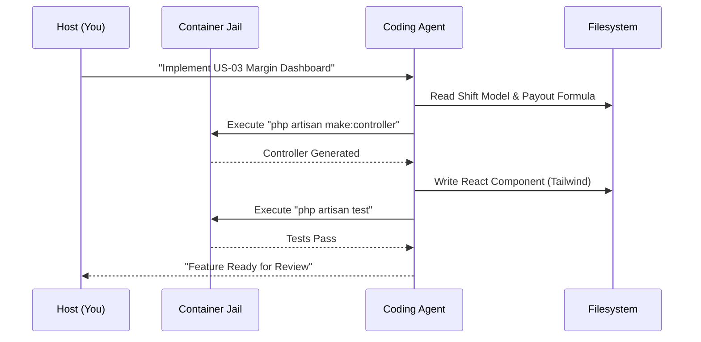
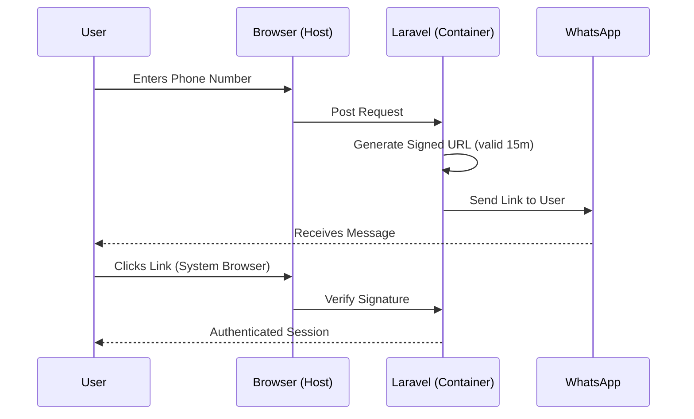

## 1. Primary Tech Stack
The stack is designed for a balance of developer velocity and production-grade stability.

| Layer | Technology | Role |
| :--- | :--- | :--- |
| **Framework** | **Laravel 13** | Core backend logic and AI-assisted development tools. |
| **Frontend** | **React + Tailwind** | High-interactivity UI with mobile-first styling. |
| **Database** | **MySQL 8.4** | Relational integrity for shift and payment records. |
| **Environment** | **Dev Containers** | Containerized "jail" for secure AI agent interactions. |
| **Auth** | **WhatsApp Magic Link** | Frictionless onboarding via Laravel Breeze. |

---

## 2. The Agent Isolation Strategy ("The Jail")
The coding agent operates entirely within a restricted Docker container. This prevents any AI-generated code or commands from accessing your host system's sensitive data (e.g., SSH keys, credentials, or other projects).

### Key Constraints:
* **Scoped Workspaces:** The agent's root directory is strictly limited to `/workspaces/bikerflow`.
* **Command Execution:** The agent executes `artisan`, `composer`, and `npm` commands within the container's isolated shell.
* **Application Hosting:** `php artisan serve` runs inside the container, with ports 8000 (app) and 5173 (Vite) forwarded to your host browser for testing.
* **State Snapshotting:** The environment can be reset or "rolled back" if the agent introduces breaking architectural changes.

---

## 3. Business Logic & Formulas
The system enforces the finalized rules for payout and margin management.

### Biker Payout Formula (BR-03)
The **Base Fee** is a "show-up" fee that is only triggered if the biker completes at least one delivery.

$$
Payout = 
\begin{cases} 
0.00 & \text{if } trips\_count = 0 \\
base\_fee + (biker\_rate \times trips\_count) & \text{if } trips\_count > 0 
\end{cases}
$$

### Company Revenue Formula
$$Revenue = (restaurant\_rate \times trips\_count) - Payout$$

---

## 4. System Flows

### A. Jailed Agent Workflow
This diagram illustrates how the coding agent interacts with your codebase without escaping the container.

### B. Authentication Flow (WhatsApp Magic Link)
Frictionless login designed for high-pressure restaurant environments.

---

## 5. Security & Guardrails

* **Workflow Locking (BR-01):** Once a shift begins, the `workflow_type` (Live vs. Manual) is locked to prevent data tampering.
* **PIX Verification (BR-02):** Admin must manually verify a Biker's PIX key identity before the first payout is enabled.
* **Audit Logging (BR-06):** Every payment retry is logged as a unique transaction to prevent double-billing and provide a clear failure trail.

This setup ensures that you can use the most advanced AI features of **Laravel 13** to build the **BikerFlow MVP** while maintaining total control over your development machine's security.
